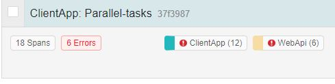
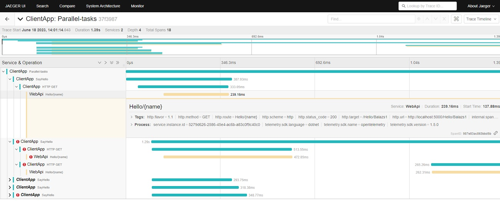

# Playing with OpenTelemetry

In this repository, I started to explore the OpenTelemetry observability framework and collected some useful links for traces, metrics, and logs.

##### The solution contains 2 projects

###### WebApi
- **Tracing exporter**: Configured for Otlp / OpenTelemetryProtocol (I used Jaeger, which supports Otlp)
- HelloController: Returns a random response (200, 400, 500, ...) to simulate real-life scenarios involving both good and bad responses.

###### ClientConsoleApp
- **Tracing exporter**: Configured for Jaeger
- Console application, which initiate HTTP calls to the WebApi
- Using [Polly](https://github.com/App-vNext/Polly) to retry and cancel the call

#### Resources
- [OpenTelemetry](https://opentelemetry.io) 📓*Official*
- Client libraries
  - [OpenTelemetry Azure Monitor Distro](https://github.com/Azure/azure-sdk-for-net/tree/main/sdk/monitor/Azure.Monitor.OpenTelemetry.AspNetCore) 👤*Azure (Client library that sends telemetry data to Azure Monitor following the OpenTelemetry specification)*
    - [Getting started with AzureMonitor OpenTelemetry Distro](https://learn.microsoft.com/en-us/azure/azure-monitor/app/opentelemetry-enable) 📚*Microsoft Learn*
  - [AzureMonitor exporter](https://github.com/Azure/azure-sdk-for-net/tree/main/sdk/monitor/Azure.Monitor.OpenTelemetry.Exporter) 👤*Azure (exporter for traces, metrics, and logs)*
  - [.NET client library](https://github.com/open-telemetry/opentelemetry-dotnet) 👤*open-telemetry (instrumentation and exporter libraries)*
  - .[NET Contrib](https://github.com/open-telemetry/opentelemetry-dotnet-contrib) 👤*open-telemetry (instrumentation and exporter libraries)*
- Blog posts from 📓*Code-Maze*
  - [Tracing applications and using Jaeger for visualization](https://code-maze.com/tracing-dotnet-applications-opentelemetry) *- Instrument WebApi requests and SQL client*
  - [Tracking application health, Metrics, Prometheus for visualization](https://code-maze.com/tracking-dotnet-opentelemetry-metrics)
  - [Alternative way of logging with OpenTelemetry](https://code-maze.com/dotnet-opentelemetry-logging) *(Console application with Exporter.Console, Traces, Events, Custom Log Processor)*
  - [Using OpenTelemetry collector, OTLP](https://code-maze.com/vendor-agnostic-telemetry-opentelemetry-collector-dotnet)
- Blog posts from 📓*Twilio*
  - [Propagate OpenTelemetry Context via Azure Service Bus](https://www.twilio.com/blog/propagate-opentelemetry-context-via-azure-service-bus-for-async-dotnet-services)
  - [Automatic instrumentation of containerized applications](https://www.twilio.com/blog/automatic-instrumentation-of-containerized-dotnet-applications-with-opentelemetry) | [Source code](https://github.com/rahulrai-in/autoinstrumentation-demo)
  - [How to build logs pipeline in with OpenTelemetry](https://www.twilio.com/blog/build-a-logs-pipeline-in-dotnet-with-opentelemetry)
  - [Export logs to AzureMonitor](https://www.twilio.com/blog/export-logs-to-azure-monitor-with-opentelemetry-and-dotnet)
- [OpenTelemetry will save your day and night](https://www.youtube.com/watch?v=pz4bNmlss3w) 📽️*1hour- Alexey Zimarev - NDC Oslo, 2021*
- [Example of automatic and manual instrumentation](https://logz.io/blog/csharp-dotnet-opentelemetry-instrumentation) 📓*logz.io*
- [Logging with OTLP to Seq](https://blog.datalust.co/self-hosted-opentelemetry-logs) 📓*Seq blog*
- [Set up OpenTelemetry with Event Sourcing and Marten](https://event-driven.io/en/set_up_opentelemetry_wtih_event_sourcing_and_marten) 📓*Oskar Dudycz*
- [Jaeger](https://www.jaegertracing.io): Open-source, end-to-end distributed tracing
  - [Download Jaeger](https://www.jaegertracing.io/download) -> Run: jaeger-all-in-one.exe -> http://localhost:16686

---

**OpenTelemetry vs .NET terminology**

| OpenTelemetry | .NET            |
| ------------- | --------------- |
| Tracer        | ActivitySource  |
| TelemetrySpan | Activity        |
| SpanContext   | ActivityContext |

---

##### Screenshot after running the WebApi and the ClientConsoleApp

